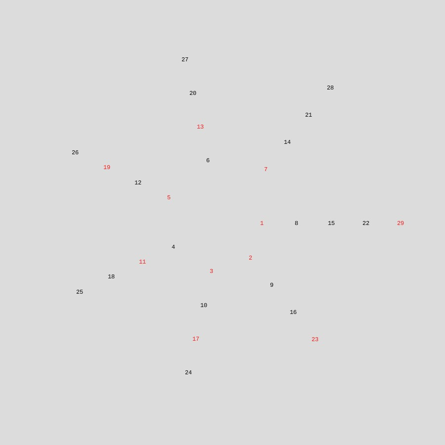

# Spiral No.7

I created a spiral in an 900by900document
with an angle incement of TAU/7
. The rate of growth was 10
and the initial radius was 80
. The algorithm stopped at the final radius: 370
and created numbers ranging from 1 to 29.
# Numbers
1. 1, 8, 15, 22, 29, 
1. 2, 9, 16, 23, 
1. 3, 10, 17, 24, 
1. 4, 11, 18, 25, 
1. 5, 12, 19, 26, 
1. 6, 13, 20, 27, 
1. 7, 14, 21, 28, 
## Primes found: 11

## Prime pattern:
1. 1| █  .  .  .  █ 
1. 2| █  .  .  █ 
1. 3| █  .  █  . 
1. 4| .  █  .  . 
1. 5| █  .  █  . 
1. 6| .  █  .  . 
1. 7| █  .  .  . 
